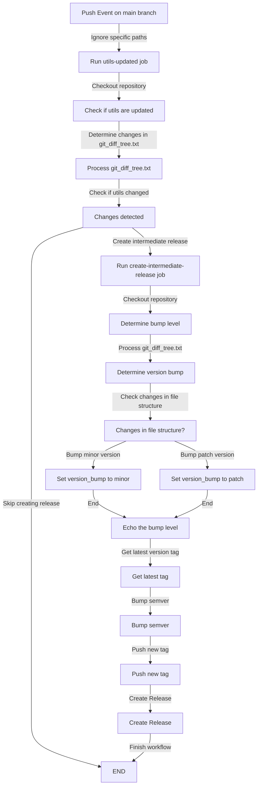
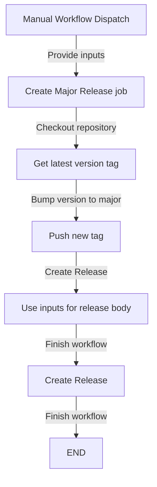

# Release Workflows

This document outlines the release workflows used in this project. These workflows, implemented using GitHub Actions, automate the process of versioning, bundling, and releasing the project. The workflows are triggered under specific conditions, and they follow semantic versioning. They where created such that any changes made are automatically available to the users of the project.

## Workflow: Create Minor or Patch Release

## Workflow: Create Major Release

